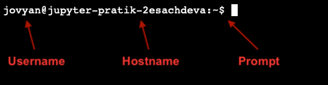

# Bash: The **B**ourne **A**gain **SH**ell

We're starting this workshop with a brief tutorial on bash, which is short for
the "Bourne Again Shell".

Let's dissect that name. The "Bourne Again" part just means that it's second
version of a previous shell called "Bourne". The important part to focus on is
the "Shell". What exactly is that?

Let's get some terminology out of the way:

* First, you may have heard of a **terminal**. This is a software that can print
  text to your screen, and accept keyboard input. Nothing really special here -
  most programs do that.
* What makes a terminal special is the **shell** it uses to accept input and
  print output. So, your terminal might run a **bash** shell, which is one of
  the most commonly used shells. But there are others - for example, **zsh** or
  Z shell is starting to be rolled out by default on Macs. If you're worried
  about which one you're using, don't stress too much. At this point, the
  differences between shells lie in pretty niche tasks that won't matter for
  this workshop.

So, we have a terminal that runs a shell. What exactly does the shell do?

The shell allows us to interact with our filesystem in a variety of ways:
navigating through our folders, creating new files, editing existing ones, etc.
We can also run software from the terminal. For example, you might be familiar
with running a Jupyter Notebook from the terminal, or using `conda`
environments.

You might be wondering: why bother even using a shell when we have software
(specifically, Graphical User Interfaces, or GUIs) that can let us do all these
things for us? There's a lot of reasons for this (see
[here](https://ux.stackexchange.com/questions/101990/why-are-terminal-consoles-still-used)
for some discussion), but one short answer is that using the terminal is a
standardized, efficient, and expressive way of completing general purpose tasks.
The downside is that it comes with a bit of a learning curve. Once you get over
the hump, though, you'll find yourself leaning more into the terminal than any
GUI. The goal of this workshop is to get you on your way past the learning
curve.

Let's get started by going over some basic bash commands.
# Basic Bash Commands

Go ahead and open up a terminal. What do you see? It might look something like
this:

The anatomy of a basic terminal prompt is simple: you'll usually have a username
(leftmost) followed by an at symbol (@), followed by the hostname (a fancy way
of saying what machine you're on), and then a prompt, which might be a dollar
sign followed by a rectangular block. The dollar sign (or whatever prompt symbol
is there) indicates where user input starts. The rectangular block is your
cursor.

Your prompt might not look like this! Some prompts can be pretty fancy, and
contain a lot of useful information to the user. The only thing that matters
right now is entering input.

## Basic Bash Commands

Let's start with some basic bash commands. Try entering these into the prompt,
and see what happens:

> Note: at any point, you can press `TAB` to autocomplete a partially completed
> input. Give it a shot on the following commands!

* `whoami`: Print the current user.
* `pwd`: Print the **p**resent **w**orking **d**irectory.
* `ls`: List the files in the working directory.

What's the working directory? At any given point in a terminal, we'll be located
in a particular spot in our filesystem. This location can be identified by the
series of folders we need to look into to get there. The working directory,
then, is our current location.

## Changing Directories

Being in this folder is nice, but what if we wanted to move to another location?
Luckily, there's a command for that: **cd**, for  **c**hange **d**irectory. But
there are several ways to use `cd`.

1. `cd ..`: This is moving to one directory above our current location.
2. `cd solutions`: This is moving to the `solutions` folder (if you're not in
   the `Bash-Git` folder, use some other folder name).
3. `cd`: No extra input! What folder do you move to? How can you check?
4. Navigate back to the `Bash-Git` folder using `cd` and a chain of folders.
5. `cd ~`: What location do you end up in? This is the **home** directory -
   we've already been here! The tilde `~` is just shorthand for this special
   location.

A chain of folders that specifies a location is called a **file path**. There
are two ways of specifying file paths:

* **Absolute file paths** are relative to the **root directory**, which is the
  uppermost level of a file system. Absolute file paths always start with a
  forward slash `/`.
* **Relative file paths** are relative to your working directory. These paths
  start with no forward slash or a `./` (the period is shorthand for the working
  directory).

In specifying file paths, you can use the `~` as a shorthand for your home
directory.

## Creating Directories and Files

Now, we know how to navigate folders. How can we create new folders, and files?
Try the following commands:

* `mkdir test`: This will make a new directory called `test`. Try a different
  folder name. How can you check to see if the folder was created?
* `touch test.txt`: This will create a file named `test.txt`.
* `cp`: Copy and paste. There are two arguments here: the source and the
  destination.
  * Try copying `test.txt` to the `solutions` folder. You need to add in the
  relative path when setting the destination (`solutions/test.txt`).
* `cp -r`: Bash commands sometimes come with **flags**, which are additional
  specifications to how we run the command. Flags are always preceded by one or
  two dashes. The `-r` flag for `cp` indicates we should do a recursive copy.
  This is specifically for folders, which may have multiple copies to do.
  * Copy the `test` folder to the `solutions` folder.
* `mv`: Moving a file is just like copying, but it does not leave a version in
  the source.
  * Create a file called `test2.txt` and move it to the `img` folder.
* `rm`: Removing a file. Use the `-rf` flag for folders: this is the `-r` flag
  (recursive) and `-f` flag (force the removal) combined.
  * Navigate to `solutions`, and remove `test.txt` and `test`.
  * Navigate to `img`, and remove `test2.txt`.

## Viewing and Editing Files

How can we view files? This depends on the type of file we're working with,
which is specified by the extension. Most files we'll work with are composed of
some kind of text such as `.txt` files, `.py` files, `.R` files, etc. Here are
some approaches to view their contents quickly:

* `cat`: View all the contents of a file. This command is short for
  "concatenate", because it can be applied to multiple files.
  * Try using `cat` on one of the files in this directory.
* `less`: This is useful when your file is too big for `cat`, and you quickly
  just want to see a small portion of it.
  * Try using `less` on one of the file in this directory. Note: this might
  not work if you're using DataHub.

These commands are useful for quickly viewing files, but how about editing
files? There are several programs in bash you can use to do this: `vim`, `nano`,
and `emacs` are some examples.

`vim` is most likely to already be installed on your computer, so you can give
that a shot. There's a whole assortment of keyboard shortcuts for using `vim`,
but here's enough to create a simple file:

1. `vim text.txt` to open up a file called `text.txt`.
2. By default, `vim` opens the file in **view** mode. You can't edit it right
   now - you need to switch to **insert** mode. Press `i` to switch to insert
   mode.
3. Add some text while in insert mode.
4. Press `Esc` to exit insert mode.
5. To save and quit the file, you need to go to command mode. Press `:` to enter
   command mode.
6. Enter `wq` followed by `Enter`. This is telling `vim` to **w**rite the
   changes and **q**uit.

## Reference: Keyboard Shortcuts

Here are some keyboard shortcuts you can keep in mind as you become more
familiar with bash:

* Up/down arrow keys: cycle through previous commands.
* `Option + `left/right arrow keys:* Move the cursor word by word.
* `Ctrl-C`: Abort process.
* `Ctrl-D`: Terminate input.
* `Ctrl-R`: Search previous input.
* `Ctrl-L`: Clear console.
* `Ctrl-A`: Move cursor to beginning of line.
* `Ctrl-E`: Move cursor to end of line.
* `Ctrl-K`: Cut to end of line.
* `Ctrl-U`: Cut to beginning of line.
* `Ctrl-Y`: paste.

## Bash Challenge

You now have a working understanding of bash! Go ahead and open
`02_bash_challenge.md` and give the challenges a shot!
