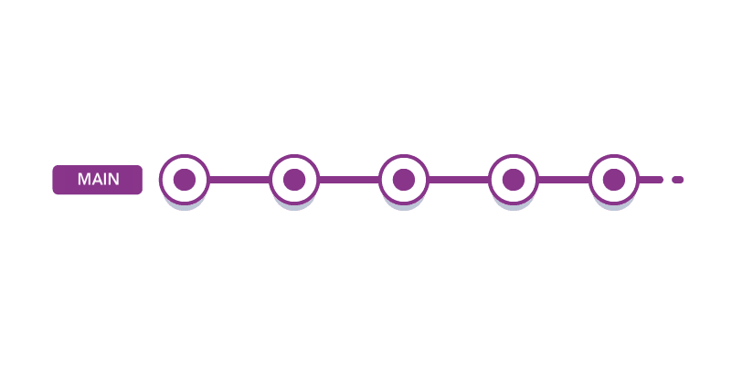
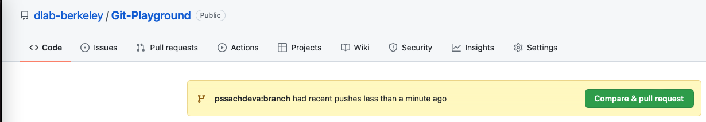

# Why Use Version Control?

Imagine that you’re collaborating with one of your labmates on a project. You’re
both making changes to functions in the codebase. At one point, you both have
changed the same lines in a particular function. How do you go about merging
your changes so that you’re both using the same code?

This is the rationale for version control: a system that manages and records
changes to a codebase. The most commonly used version control system is called
`git` (others include Mercurial and SVN). `git` is often used in tandem with a
cloud-based hosting platform - the most common is Github (but others include
Gitlab and Bitbucket). The benefit to using Github is that it makes it easier to
collaborate on code with others via its web platform.

In this lesson, we're going to use the terminal (i.e., bash) to make updates to
a repository using `git` and Github.

There are several different workflows in which you might imagine using `git`,
particularly in an academic setting. These include:

1. Working on a repository that is your own repo. You expect that you will
   generally be the only person developing code for this repository.
2. Working on a repository that several people - perhaps some collaborators -
   are working on concurrently.
3. Working on a repository that *many* people (e.g., at least dozens) are
   involved in. This may be, for example, an open-source project to which you
   contribute changes. We will not cover this approach in this workshop, as the
   details may be specific to the project you're working on. However, the
   principles from approach #2 hold here.

# Personal Workflow

In the personal workflow, you are largely going to be the only person adding to
the repository. You have one "branch", or version of the code: it'll likely be
called the `main` branch (in older Github repositories, it may be called the
`master` branch). Every time you make changes to the code, you'll add them to
the `main` branch. So what's the benefit to using `git`?

`git` keeps track of the differences in the repository each time you make a
change. The **entire** history of the repository is tracked by `git`. If you
realize you made a mistake in your code, you can always roll it back to a
previous timepoint.

Each step in the Personal workflow is actually comprised of a set of smaller
steps. Before we go through each step, we need to make a distinction between two
kinds of repositories: there's the local repository and the remote repository.
The local repository is easy: that's the version of the code that sits on your
computer. The remote repository, meanwhile, is any version of the repository
that lies on some other machine. In this context, it's almost always going to
refer to the version that sits on Github's servers.

So, when we're making changes to a repository, there's two versions that need to
stay in sync with each other: the local and the remote. The steps we outline
keep track of those changes between both cases, while also keeping track of the
entire history. Github provides a nice platform on which we can peruse the
history of a repository.

Let's go through the process of making changes to a repository, step by step.

1. **Creating a new repository on Github.** Go to this
   [link](https://docs.github.com/en/get-started/quickstart/create-a-repo) and
   follow the instructions on how to create a new repository on Github. Once
   you've done this, you have a remote repository (on Github's servers), but
   **not** a local repository.

2. **Cloning.** We've done this with the `Bash-Git` repo. Cloning a repository
   means taking a remote repository, and copying it to our local machine to
   create a local repository. Let's clone the repo we just created. Open up a
   terminal and run the command: `git clone [REPO-LINK]`, filling in the
   `[REPO-LINK]` with the appropriate name provided by Github.

3. **Checking the status.** A useful command to always run is `git status`. This
   will provide a summary of what's going on in your repo. Run it to see what
   happens - all it should say is that it's up to date with `origin/main`: this
   means that it's up to date with `origin`, which is its name for the remote
   repo. Within `origin`, it's synced to the `main` branch.

4. **Making a change.** Let's make a change by creating a new file. Create a
   file called `text.txt`, which has some text in it of your choosing. Then, run
   `git status` and see what happens.

5. **Staging a change.** The first step to codifying this change in the `git`
   history is to stage it, which is done with the `git add` command.
   Once a change is "added", it is placed in a staging area. You can think of
   this as a "proposal" for the next record in the Git history. The proposal is
   made permanent in the following step. To add the file, run `git add test.txt`.

   **Note**: "add" does not have the exact same meaning as the English word:
   it actually means adding an operation. For instance, if we remove test.txt
   locally by throwing it in the trash, and we then want to remove it from the
   staging area and remote repo, we still do `git add test.txt`!

6. **Committing a change.** Next, once we've added all the changes we want to
   the staging area, we need to commit them. Committing changes entails taking a
   snapshot of them: once we do this, the changes are frozen and placed in the
   `git` history. Each commit needs an accompanying message to say what the
   reason for the commit is. Make sure these messages are informative - your
   future self will thank you! Commit the file by running `git commit -m "adding
   test file"`.

7. **Pushing to the remote.** Right now, the local repo knows about the changes
   we did, but the remote repo doesn't. So, we need to synchronize the two by
   "pushing" our changes to the remote repo. We can do this by running the
   command `git push origin main`: we are pushing the changes we made to
   `origin` (the name of the remote repo), on the `main` branch.

8. Check Github to see if the changes you made manifest on the website! You can
   run a final `git status` for posterity's sake.

So, even in the personal workflow, there's a lot of individual steps needed just
to make changes to the codebase. This becomes a little bit more complicated when
multiple people are making changes at the same time, which requires a slightly
different workflow.

Open up `03_git_challenge.md` and give Challenge 1 a shot!

# Collaborative Workflow

In the collaborative workflow, multiple people may be working on the same
repository at the same time. So we need to have a system in place for how to
decide whose changes to add, and how to handle scenarios when changes may clash
with each other.

Collaborative workflows heavily rely on **branching**. We've already seen this
terminology in the context of the `main` branch. Now, we might be interested in
adding a new feature to a code repository. When working collaboratively, we
create a **branch** off the `main` repository. This branch can be updated in
parallel, without modifying the `main` branch. When we've committed all the
changes to the feature branch, how do we go about incorporating them into the
`main` branch?

With Github, we do a **Pull Request** (PR). In a PR, we are requesting the
`main` branch to pull the changes from the feature branch into the `main`
branch. Github provides a very nice platform to handle PRs - users can view the
PRs, comment on them, and ask for changes. Once the maintainer of the repo is
satisfied, they can merge the PR and the `main` branch is updated with the
changes in the feature branch.

The process of merging the changes in this way allows people to work in parallel
on the `main` repo without modifying the `main` branch. Couple this with
Github's platform for handling PRs, and you have a powerful tool for
incorporating parallel changes into a repository.

Let's give this a shot! You are going to make a change to an existing repository
and submit a pull request for it. We'll be working in a repository called
`Git-Playground` which is available on the D-Lab Github at [this
link](https://github.com/dlab-berkeley/Git-Playground).

1. **Forking the repository.** An extra step you can take when working on a
   collaborative repository is to **fork** the repo. This creates a copy of the
   repository on your own Github account, which you're free to change at will.
   You can still, however, pull changes from the original repo, and make pull
   requests with your own changes. Go ahead and fork the repo that I just
   created. See the image below for where to find the button:

2. **Cloning.** Clone the forked repo to your local machine.

3. **Branching.** Create a new branch on your local machine using the command
   `git checkout -b BRANCH_NAME` or `git branch -c BRANCH_NAME`.
   Choose a branch name that feels appropriate to
   you. Run `git status` afterward to see how things changed.
   You can check out which branches you have, and which you are currently on,
   by running `git branch`.

4. **Commit a change.** Create a new file with some text, stage it, and commit
   it.

5. **Push the change.** Push the change on this branch to your remote repo.
   You'll still use `git push`, but the command is slightly different: it will
   be `git push origin BRANCH_NAME`. You're pushing to the remote (`origin`) on
   the `BRANCH_NAME` branch.

6. **Make the Pull Request.** Go to the `Git-Playground` repository on Github.
   You should see something like the following image pop up. Github can already
   tell you made a change, and gives you the option to make a pull request! If
   you don't see this button, no worries - go to the "Pull Requests" button next
   to Issues, and you can manually make one there. Follow the instructions for
   making the pull request, and we'll merge a couple of them!

# Removing git repositories

* **Local:** If you want to delete local git-related information (like
  branches and versions), all you have to do is delete the `.git` directory in
  the root-directory of your repository. Note that `.git` directories are hidden
  by default, so you'll need to be able to view hidden files to delete it.
  If you want to delete everything (data, code, etc.), just delete the whole
  directory.

* **Remote** : If you want to delete a remote repository, navigate to GitHub and
go to Settings, then Danger Zone (at the bottom of the Settings page). Warning:
Once you delete a repository, there is no going back.

# Learning more

That's the workflow! There are other `git` practices we didn't cover - handling
merge conflicts, rebasing, etc. As you get deeper into `git`, you can peruse the
Github documentation for tips on how to do these more advanced `git` commands.
